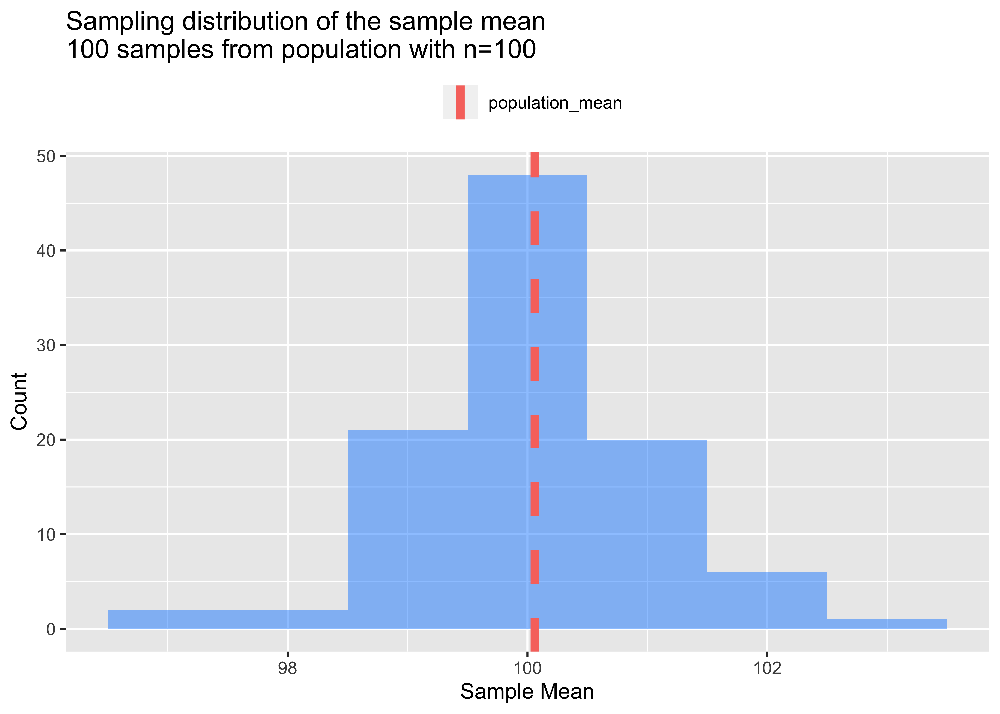
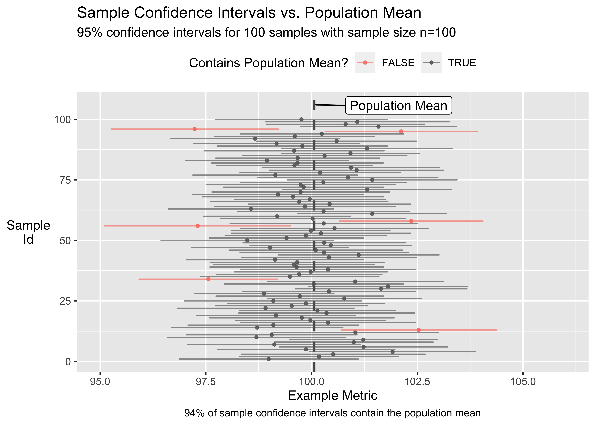
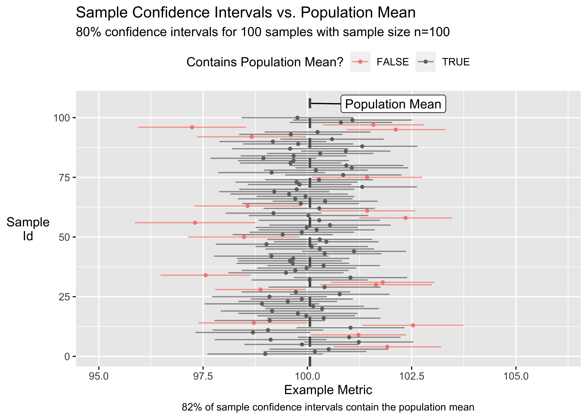
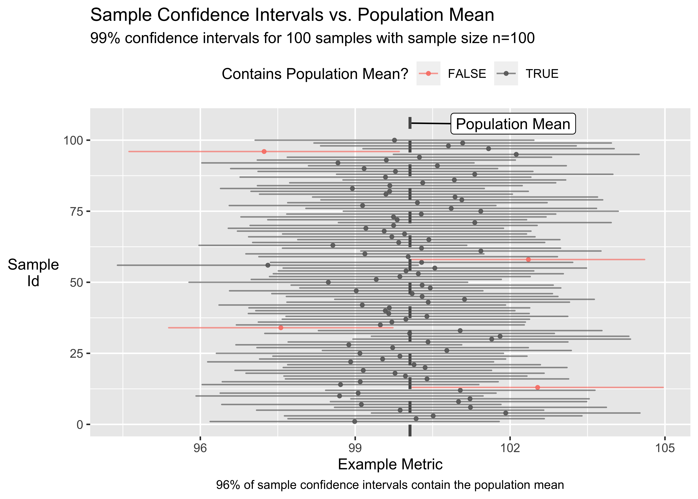
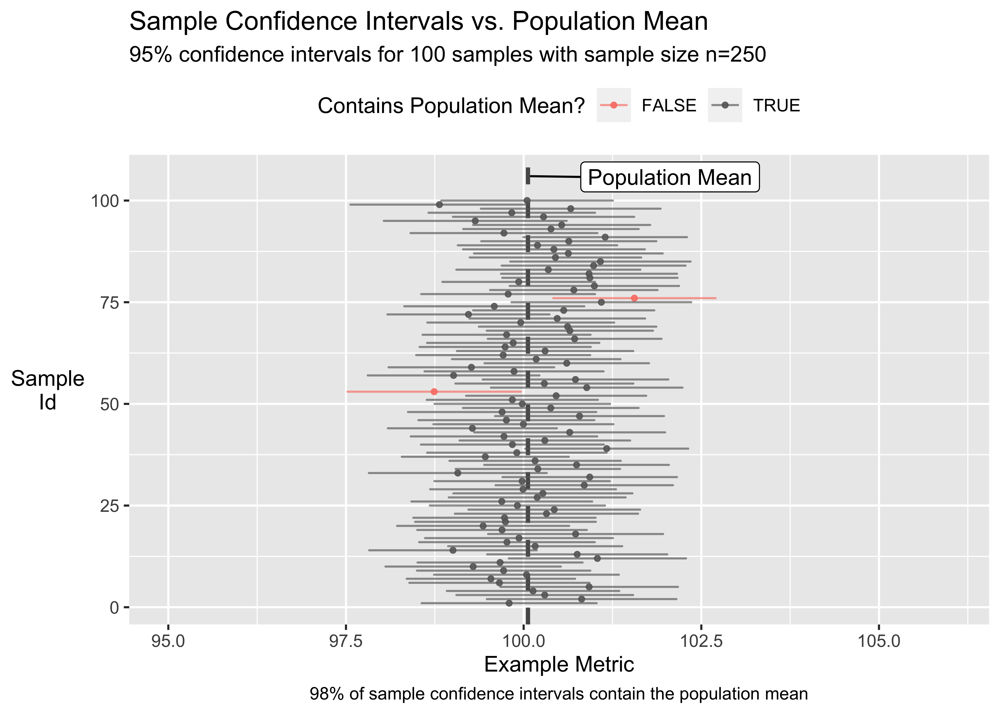

Confidence Interval Intuition
================

### What is a 95% confidence interval?

  - When relevant methodology conditions are met, we’d expect the
    interval to capture the true population parameter 95% of the time
    over the long run.
  - Confidence intervals are often derived from sample data.
  - We’re using the sample data to infer about a population of interest.
  - The sample point estimate is do not capture variability in the
    point. The confidence interval is a method to quantify sample point
    estimate variability.

<!-- end list -->

``` r
library(tidyverse)
library(infer)
library(ggrepel)
library(patchwork)
```

### Example data

  - Generate an example population with known mean so we can compare
    sample point estimates and intervals vs. the population mean.

<!-- end list -->

``` r
set.seed(1234)
population_df <- tibble(metric_example = rnorm(10000, mean = 100, sd = 10))
population_mean <- mean(population_df$metric_example)
```

### Function to generate 100 sample reps from the population

  - Create a sampling distribution which takes repeated samples from the
    population.
  - Repeated samples form the sampling distribution which is used to
    illustrate the intuition behind confidence intervals.

<!-- end list -->

``` r
### 100 samples of size 100
### reps fixed at 100 (meaning we want 100 samples of size=size_var)
repeated_samples_df <- function(size_var) {
  set.seed(121)
  infer::rep_sample_n(tbl = population_df, 
                      size = size_var,
                      replace = FALSE,
                      reps = 100) %>%
  mutate(sample_size = size_var)
}
```

### Function to derive sample stats across the 100 samples

``` r
### for each sample derive stats
ci_df <- function(ci_level, df_var) {
df_var %>%
  group_by(replicate) %>%
  ### we could also write this using t.test()
  summarise(confidence_level = ci_level,
            tvalue = qt(confidence_level + 
                          (1-confidence_level)/2, df=unique(sample_size)-1),
            sample_mean = mean(metric_example),
            standard_error = sd(metric_example) / sqrt(n()),
            lower_bound = sample_mean - (tvalue * standard_error),
            upper_bound = sample_mean + (tvalue * standard_error),
            contains_pop_mean = between(
              x = population_mean, left = lower_bound, right = upper_bound
            )
  ) %>%
  ungroup() %>%
  mutate(pct_of_intervals_containing_pop_mean = 
           sum(contains_pop_mean==T) / n(),
         pct_of_intervals_containing_pop_mean = scales::percent(
           pct_of_intervals_containing_pop_mean
         ))
}
```

### Visualizing the sampling distribution

  - When certain conditions are met, the sampling distribution is
    normally distributed around the population mean.

<!-- end list -->

``` r
repeated_samples_df(size_var = 100) %>%
  group_by(replicate) %>%
  summarise(sample_mean = mean(metric_example)) %>%
  ggplot(aes(x=sample_mean)) +
  geom_histogram(binwidth = 1, alpha=0.5, fill="dodgerblue") +
  geom_vline(aes(xintercept=population_mean, color="population_mean"),
             size=2, linetype="dashed") +
  labs(title="Sampling distribution of the sample mean
100 samples from population with n=100",
       x="Sample Mean",
       y="Count",
       color="") +
  theme(legend.position = "top")
```



### Confidence interval plot function

``` r
ci_plot <- function(df_var) {
 ggplot() +
  geom_vline(aes(xintercept=population_mean),
             linetype="dashed", size=1, alpha=0.7, show.legend = F) +
  geom_label_repel(aes(x=population_mean,
                y=106,
                group=1),
                label="Population Mean",
                show.legend=F,
                nudge_x = 2, nudge_y = 3) +
  geom_point(data=df_var,
             aes(x=sample_mean,
                 y=replicate,
                 color=contains_pop_mean), 
             alpha=0.85, size=1) +
  geom_segment(data=df_var,
               aes(y=replicate,
                   yend=replicate, 
                   x=lower_bound, 
                   xend=upper_bound,
                   color=contains_pop_mean),
               lineend="round", alpha=0.65) +
  scale_color_manual(values = c("salmon", "grey40")) +
  theme(legend.position = "top",
        axis.title.y = element_text(angle = 0, vjust = 0.5),
        plot.caption = element_text(hjust = 0.5)) +
  labs(title="Sample Confidence Intervals vs. Population Mean",
       x="Example Metric",
       y="Sample\nId",
       color="Contains Population Mean?",
       caption = paste0(unique(df_var$pct_of_intervals_containing_pop_mean),
       " of sample confidence intervals contain the population mean")
  )
}
```

### As expected, nearly 95% of the sample confidence intervals capture the true population mean

  - As stated above, when conditions are met, we’d expect 95% of the
    intervals to capture the true population mean in the long run.
  - In practice, the population mean is often unknown and we use a
    sample to infer about the population mean.
  - This notebook generates a sampling distribution to demonstrate the
    intuition behind confidence intervals. In most cases, we wouldn’t
    repeatedly sample a population like this. We’d instead generate one
    sample as large as possible given our domain constraints of time,
    cost, feasibility, etc.

<!-- end list -->

``` r
ci_plot(ci_df(ci_level = 0.95, df_var = repeated_samples_df(size_var = 100))) +
  labs(subtitle = "95% confidence intervals for 100 samples with sample size n=100") +
  scale_x_continuous(limits = c(95, 106))
```



### Holding other factors constant, a decrease in confidence level shrinks interval width.

  - Holding other factors constant, a decrease in confidence level also
    leads to a higher proportion of intervals that don’t capture the
    true population parameter.

<!-- end list -->

``` r
ci_plot(ci_df(ci_level = 0.80, df_var = repeated_samples_df(size_var = 100))) +
  labs(subtitle = "80% confidence intervals for 100 samples with sample size n=100") +
  scale_x_continuous(limits = c(95, 106))
```



### Holding other factors constant, an increase in confidence level increases interval width.

``` r
ci_plot(ci_df(ci_level = 0.99, df_var = repeated_samples_df(size_var = 100))) +
  labs(subtitle = "99% confidence intervals for 100 samples with sample size n=100")
```



#### Holding other factors constant, an increase in sample size shrinks interval width.

``` r
ci_plot(ci_df(ci_level = 0.95, df_var = repeated_samples_df(size_var = 250))) +
  labs(subtitle = "95% confidence intervals for 100 samples with sample size n=250") +
  scale_x_continuous(limits = c(95, 106))
```



### Wrap Up

  - When relevant methodology conditions are met, we’d expect the
    confidence interval to capture the true population parameter X% of
    the time over the long run (where X% is the confidence level used
    for the interval).
  - In practice, we tend to generate one sample that is as large as
    possible given our constraints.
  - The actual population mean tends to be unknown (which is why we’re
    using a sample to infer about the population).
